# OSProject Running Containers for Application Development

Group Name: __Fill your team name__. 

Section: 3

Team Mates:
1. Siti Nurfarahanim Binti Mohd Isa  (2119316)
2. Aisha Mohammed Alwan Aljuboori (2125992)


***Questions:***

1. What is the link of the fork OSProject in your repository. ***(1 mark)*** https://github.com/frhanim13/OSProject
2. How many files and folders are in this repository. ***(1 mark)*** <br> 1 readme.md file , 1 images folder 
 


***Questions:***

1. What is default OS used to run the virtual environment for codespaces. ***(1 mark)***  Ubuntu linux 
2. What are the two options of ram, disk and vcpu configuration you can have in running codespaces . ***(1 mark)***  <br>  <br> 
OPTION 1:

RAM : 8 GB  <br> 
DISK: 32 GB  <br> 
VCPU 2 CORE  <br> 

OPTION 2: <br> 

RAM:16 GB <br> 
DISK: 32 GB <br> 
VCPU: 4 <br> 
   

3.. Why must we commit and sync our current work on source control? ***(1 mark)***   <br> So we will not lost our works and collaborators also got the latest version of the code. 

## Exploring the Terminal


***Questions:***

Look at the TERMINAL tab. Run the following commands and provide the output here. 

1. Run the command **pwd** . ***(1 mark)*** __  __
2. Run the command **cat /etc/passwd** . ***(1 mark)*** __ 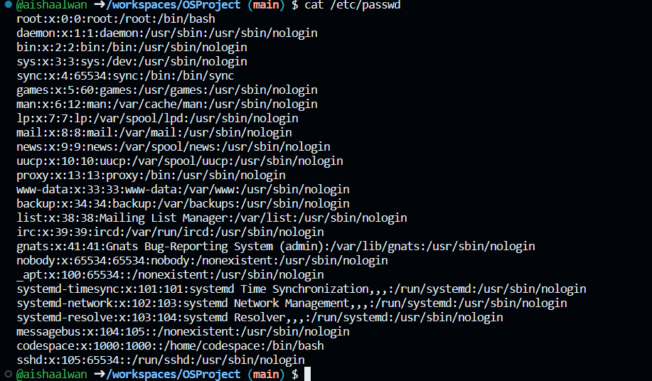 __
3. Run the command **df** . ***(1 mark)*** __ 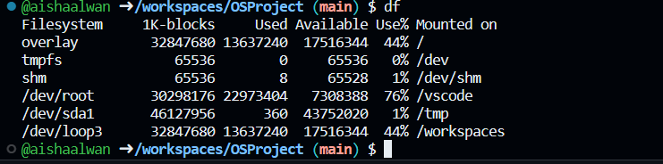 __
4. Run the command **du** . ***(1 mark)*** __ 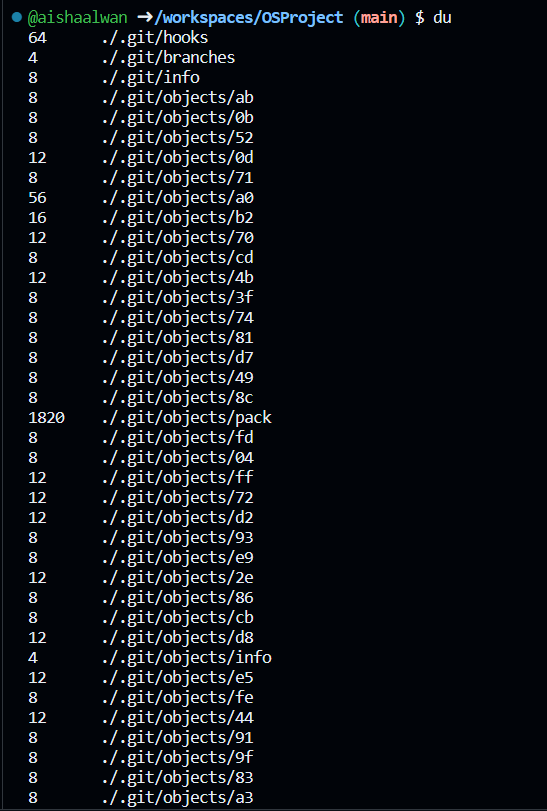 / 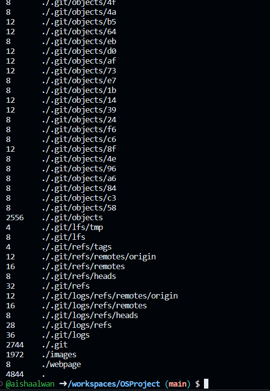 __
5. Run the command **ls** . ***(1 mark)*** __ 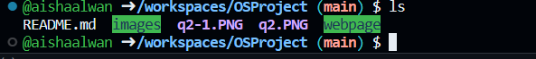 __
6. Run the command **ls -asl** . ***(1 mark)*** __ 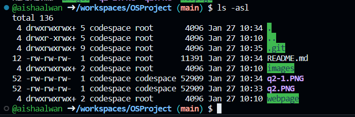 __
7. Run the command **free -h** . ***(1 mark)*** __ 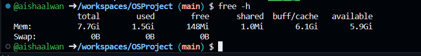 __
8. Run the command **cat /proc/cpuinfo** . ***(1 mark)*** __ 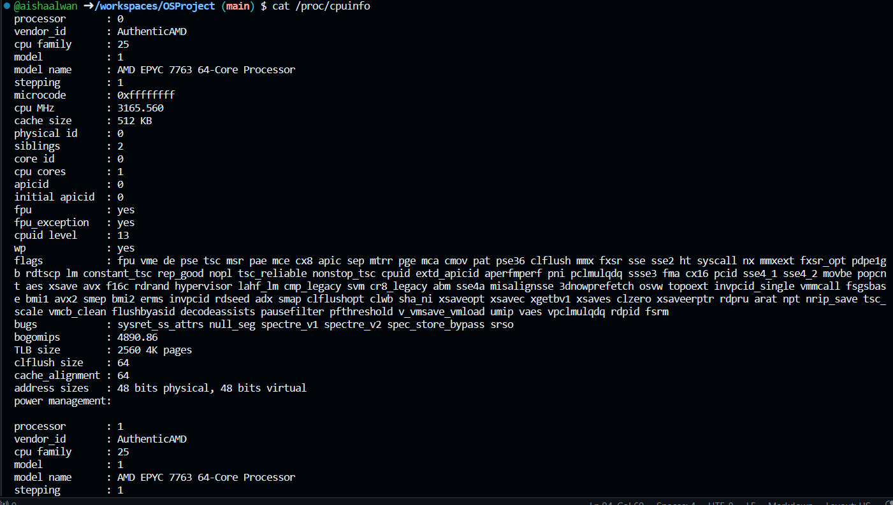 / 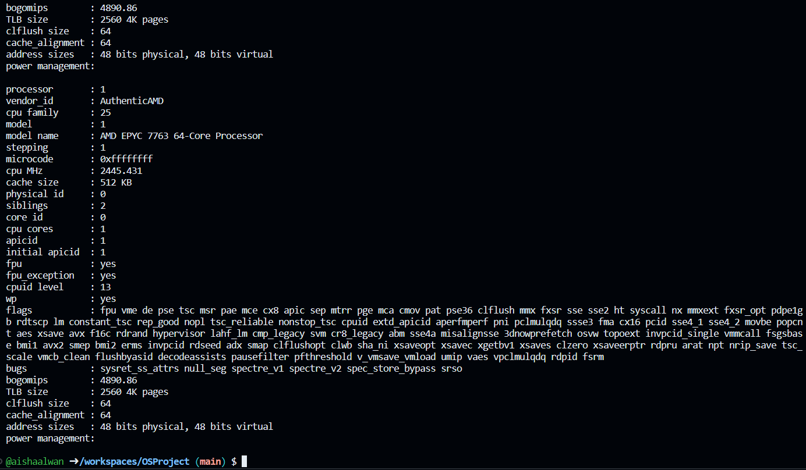 __
9. Run the command **top** and type **q** to quit. ***(1 mark)*** __ 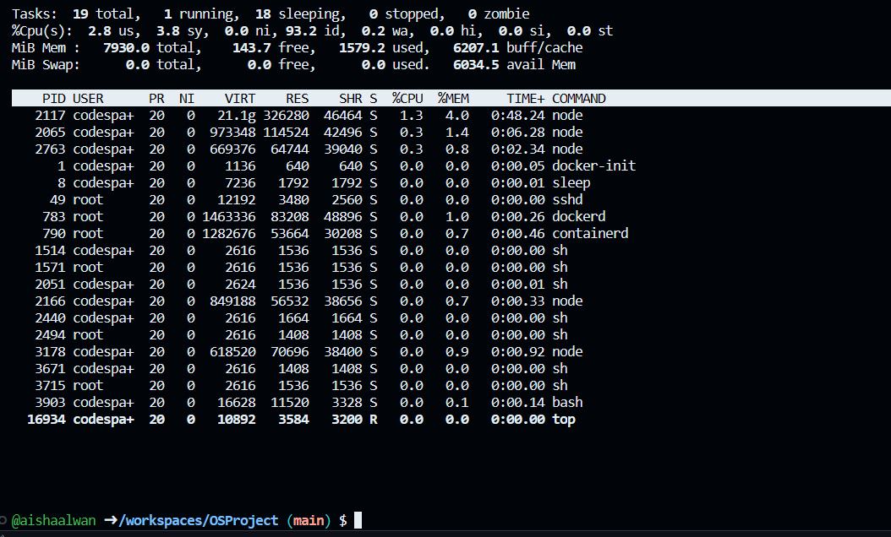 __
10. Run the command **uname -a**. ***(1 mark)*** __ 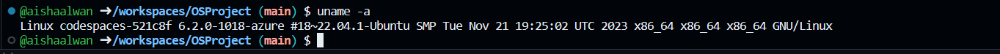 __
11. What is the available free memory in the system. ***(1 mark)*** __148Mi__.
12. What is the available disk space mounted on /workspace. ***(1 mark)*** __17516344__.
13. Name the version and hardware architecture of the linux Virtual environment. ***(1 mark)*** __Linux codespaces-521c8f 6.2.0-1018-azure #18~22.04.1-Ubuntu SMP Tue Nov 21 19:25:02 UTC 2023 x86_64 x86_64 x86_64 GNU/Linux__.
14. What is the difference between **ls** vs **ls -asl**. ***(1 mark)*** __The ls command is used to list files and directories in Linux. The ls -asl command displays some additional details__.
15. What is the TLB size of the Virtual CPU. ***(1 mark)*** __2560 4K pages__.
16. What is the CPU speed of the Virtual CPU. ***(1 mark)*** __3165.560__.
17. What is the top running process that consumes the most CPU cycles. ***(1 mark)*** __10:44:13 up 38 min, 0 users, load average: 1.05, 0.39, 0.28__.

## Running your own container instance.


6. Stop the container and run **docker ps -a**, and restart the container again. Is your file in the container still available? <br> **YES**


7. Stop the container and delete the container. What happened to your helloworld.txt? <br> **it got deleted as well**


***Questions:***

1. Are files in the container persistent. Why not?. ***(1 mark)*** It is not persistent 
3. Can we run two, or three instances of debian linux? . ***(1 mark)*** Yes, either by virtualization or containers

## Running your own container with persistent storage


***Questions:***

1. Check the permission of the files created in myroot, what user and group is the files created in docker container on the host virtual machine? . ***(2 mark)*** <br> 
 <br> user : codespace <br>  group : codespace 

2. Can you change the permission of the files to user codespace.  You will need this to be able to commit and get points for this question. ***(2 mark)***
```bash
//use sudo and chown
sudo chown -R codespace:codespace myroot

```


## You are on your own, create your own static webpage


***Questions:***

1. What is the permission of folder /usr/local/apache/htdocs and what user and group owns the folder? . ***(2 mark)***  <br>  <br> user : 1000  <br> group : 1000 

2. What port is the apache web server running. ***(1 mark)*** 8080
3. What port is open for http protocol on the host machine? ***(1 mark)*** 80 <br> 

<br>


## What to submit

1. Make sure to commit all changes on your source control, and make sure your source control is sync to the repository. 
2. Check your repository link, to see if all the files and answers are included in the repository. 
3. Submit through italeem, by providing the link to your repository.
4. Due by ***31 January, 2024***
